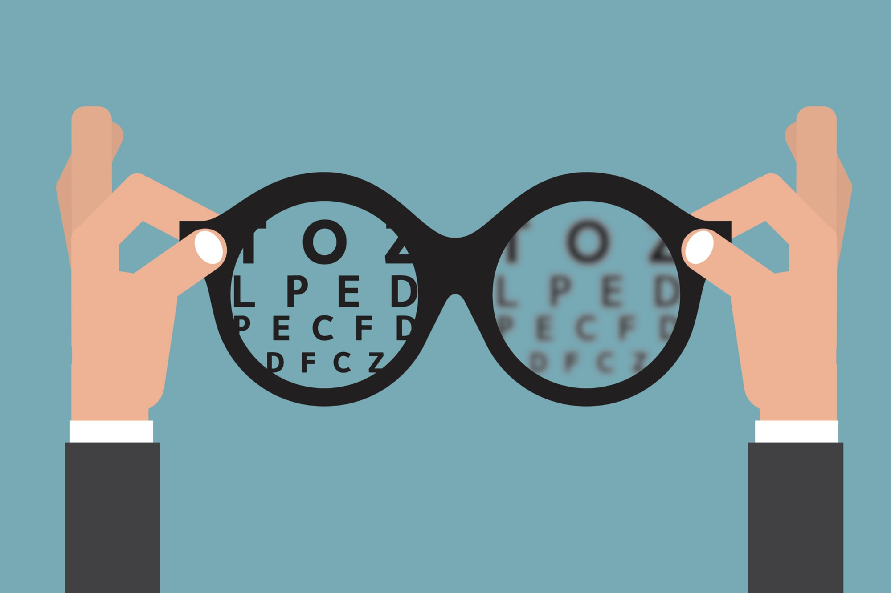

# Alerta aos Jovens e Adultos - Os novos hábitos diários e os cuidados com a visão.

De acordo com o CBO ( Conselho Brasileiro de Oftalmologia) , o Brasil possui 1,2 milhão de cegos e 6 milhões de pessoas com perda visual significativa .As causas são diversas , mas na maioria destes casos , a perda da visão poderia ter sido interrompida com prevenção e diagnóstico precoce .
É de extrema importância alertar os jovens  e adultos sobre a saúde dos olhos , principalmente aqueles que ficam muito tempo expostos à luz dos computadores.celulares e eletrônicos , o que pode causar danos a visão .  

Estudos comprovam o aumento da miopia na população em geral devido novos hábitos . Uso excessivo dos eletrônicos, vida sedentária e pouca exposição ao sol , produzindo menos a vitamina D , tão importante para a Saúde ocular e do sistema nervoso , assim como todo organismo.
A consulta preventiva ao oftalmologista deve acontecer pelo menos 1 vez ao ano , desde que o paciente não tenha nenhuma doença grave ou crônica ( por exemplo: glaucoma, alergias crônicas, uveítes de repetição, etc.)
