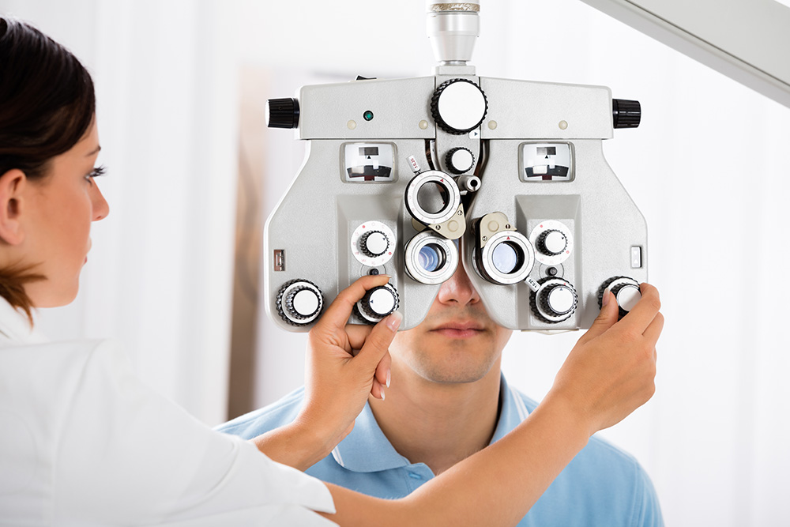

# Principais doenças oculares que podem levar à cegueira:

Ambliopia, Catarata, Ceratocone, Descolamento de retina, Degeneração macular relacionada a idade DMRI, Estrabismo, Glaucoma, Hemorragia intra-ocular, Neurite óptica, Retinopatia diabética, Retinose pigmentar, Trauma ocular, Uveítes  

# Doenças sistêmicas que afetam os olhos e a visão:

Acromegalia,
Albinismo,
Anemia,
Artrite Reativa,
Artrite psoriática,
Artrite reumatóide juvenil e do adulto,
Dermatomiosite,
 Diabetes Mellitus,
Disbiose,
Distrofia miotônica,
Doenças autoimunes,
Doenças cardíacas,
Doença da arranhadura do gato,
Doença de Behçet,
Doença de Lyme,
Doenças metabólicas,
Doenças crônico- degenerativas,
Doença de Wegener,
Doenças genéticas,
Doenças hematológicas,
Doenças neurológicas,
Doenças vasculares,
Esclerodermia,
Esclerose múltipla
Esclerose Sistêmica,
Esclerose tuberosa,
Espondilite anquilosante,
Fibrose cística,
Hanseníase,
Hipertensão Arterial ,
Hipertireoidismo,
Hiperlipidemia,
Hiperparatireoidismo,
Hipotireoidismo,
HIV/ AIDS,
Infecções sistêmicas,
Lupus eritematoso sistêmico,
Miastenia Gravis,
Neurofibromatose tipo 2
Penfigóide cicatricial
Sarcoidose,
Síndrome de Cushing,
Síndrome de Down,
Síndrome de Ehlers-Danlos ( tipo 6),
Síndrome de Marfan,
Síndrome de Reiter, 
Síndrome de Sjögren,
Síndrome de Stevens- Johnson,
Sífilis,
Obesidade, 
Poliarterite nodosa,
Toxoplasmose

