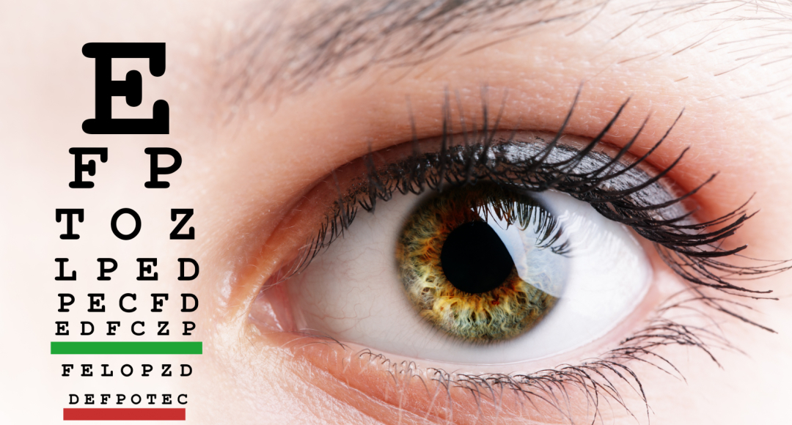

# O que é a Síndrome do Usuário de Computador e como evita-lá:

Sentir os olhos cansados, pode estar relacionado ao uso excessivo de computadores, tablets e smartphones.
Os principais sintomas são: 
Irritação nos olhos, dificuldades de enxergar quando ficam em contato com telas digitais por períodos prolongados, dores de cabeça, olhos secos, visão embaçada, dor no pescoço e ombros.<br />

# Estes ambientes podem agravar estes sintomas:

Baixa iluminação,
Distâncias inadequadas,
Brilho forte na tela do computador,
Problemas de visão não corrigidos,
Má postura ao sentar,
Combinação de todas estas condições.<br />

# Ametropias:

Presbiopia, hipermetropia, miopia, astigmatismo podem causar estes sintomas, mesmo que estejam corrigidas com óculos ou lentes de contato, se a exposição as telas digitais for muito prolongada.
Cuidando da ergonomia do ambiente, podemos amenizar e até evitar esta Síndrome.


<div className="post-image">



</div>

# O que fazer:

1- É essencial sentar na posição correta enquanto se usa o computador.<br />
2- A posição da tela deve estar no mínimo 20 graus abaixo do nível dos seus olhos.<br />
3- Posicionar a tela do computador de um modo que não haja reflexo. Faça o uso de cortinas nas janelas e use lâmpadas de LED que iluminam melhor e reduzem o consumo de energia.<br />
4- É muito importante que a cadeira que você usa todos os dias seja perfeitamente acolchoada e auxilie na sua postura. A altura deve ser numa posição em que os pés repousem nivelados com o chão .Além disso, seus pulsos não devem ficar deitados no teclado enquanto você digita.<br />
5- Fazer pausas pode prevenir a fadiga ocular e repousar e relaxar os olhos. Faça pelo menos 20 segundos de pausa a cada 20 minutos, olhando para longe, ou saindo do olhar que está para caminhar e alongar o corpo também. Nossos olhos relaxam quando olhamos para longas distâncias.
   Mantenha sua consulta oftalmológica em dia para diminuir o risco de problemas de visão.

# Fotos Créditos

```
Primeira Imagem de Jenny Friedrichs por Pixabay
Segunda Imagem de Jenny Friedrichs por Pixabay
```
