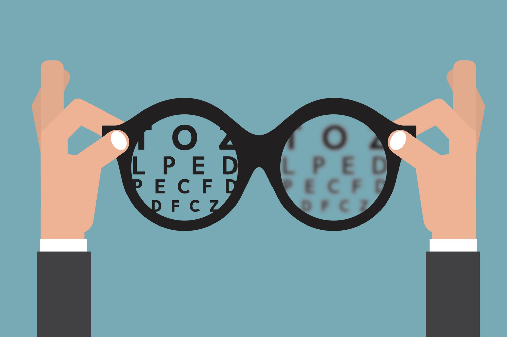

# O que é o Protocolo Coimbra?

É um outro caminho para o trabalho de doenças autoimunes.
Baseado na correção adequada da deficiência da Vitamina D, presente em todos os pacientes com doenças autoimunes.
A " vitamina D" ou colecalciferol é na realidade, atualmente considerada um pré-hormônio no meio científico. 
O uso do colecalciferol como tratamento oral em doses fisiológicas( porque nossa pele em contato com o sol produz todo dia , estas doses fisiológicas) tem baixo custo e alta efetividade. Ė capaz de manter os pacientes em boas condições de saúde prevenindo doenças autoimunes, doenças neurodegenerativas, e nos casos específicos de doenças,  promover a regressão ( remissão) dos  sinais e sintomas, evitando sequelas recentemente adquiridas  e levando ao bem - estar, qualidade de vida e o resgate da auto-estima e autoconfiança do paciente. 
Não se trata de um tratamento alternativo, mas sim um tratamento  humanizado ,focado na reconstrução de um mecanismo que a própria natureza desenvolveu com o objetivo de evitar a agressão autoimunitária contra o próprio organismo.

# A deficiência de vitamina D está associada a  causa e progressão de várias doenças:

Abortos no primeiro trimestre,
Alergias, Alzheimer, Autismo, Artrite reumatóide, Câncer, Depressão, Dermatite atópica, Diabetes tipo 1 e 2, Doença Celíaca, Doença de Crohn, 
Doença de Devic (neuromielite óptica), Distúrbio bipolar, Dor crônica, Enxaqueca, Esclerose múltipla, Fibromialgia, Hipertensão arterial, Infertilidade feminina e masculina, Lupus (discóide e eritematoso sistêmico),  
Malformações congênitas, Miastenia Gravis, Neurite óptica, Osteopenia e osteoporose, Parkinson, Psoríase, Sonolência excessiva, Uveite,Vitiligo. 
Com as novas pesquisas médicas e trabalhos científicos internacionais, os valores de referência ideais de vitamina D para adultos saudáveis devem ficar em torno de 40 a 50ng/ ml.
Para adultos portadores de qualquer das doenças acima deverão manter seus níveis de vitamina D no sangue acima de 100ng/ ml, desde que tenham acompanhamento médico adequado e períodico.  Neste caso os níveis precisam ser bem superiores pois os pacientes portadores de doenças autoimunes são parcialmente resistentes aos efeitos do colecalciferol. O nível adequado para estes pacientes será determinado mediante acompanhamento clínico e laboratorial que permita o ajuste da dose conforme a necessidade individual de cada paciente, sem o risco de efeitos colaterais graves, especialmente sobre a função renal.

# Pessoas predispostas a ter mais deficiência de vitamina D:

1 - Idade maior que 70 anos , onde a pele produz apenas um quarto da quantidade de vitamina D produzida por um jovem de 20 anos. 
2 - Pessoa com sobrepeso ( a gordura acumulada sob a pele sequestra a Vitamina D da circulação) . Em geral precisam o dobro de uma pessoa com peso compatível a sua altura. 
3 - Pessoas com pele escura: a maior quantidade de melanina diminui a absorção de raios solares. 
4 - Pessoas que trabalham ou estudam em ambientes fechados rotineiramente.Sem contato com a luz do sol. 
5 - Pessoas mal orientadas que fazem uso indiscriminado de filtros solares. O fator de proteção solar de nível 8  reduz em 90 % a produção de vitamina D e o de fator 15 reduz em 99% esta produção. 
6 - Pessoas que vivem em regiões distantes da linha do Equador, onde a radiação solar é limitada, os invernos são longos, dias são mais curtos e usam roupas que cobrem todo o corpo. 
Somado a isso , os hábitos de sedentarismo, uso de película solar nos carros , uso de metrô subterrâneo, poucas atividades ao ar livre e mais em ambientes fechados tem contribuído com aumento de Diabetes tipo 1 (cresce 6%ao ano na Europa), autismo, câncer e outras doenças pelo mundo. 
Diante destes fatos solicite ao profissional de saúde que cuida de você a dosagem no sangue de 25(OH) D3 .
Se tiver abaixo de 30 ng/ ml e você não tiver nenhuma doença, já poderá iniciar a suplementação em doses fisiológicas e com boa orientação e acompanhamento médico.

